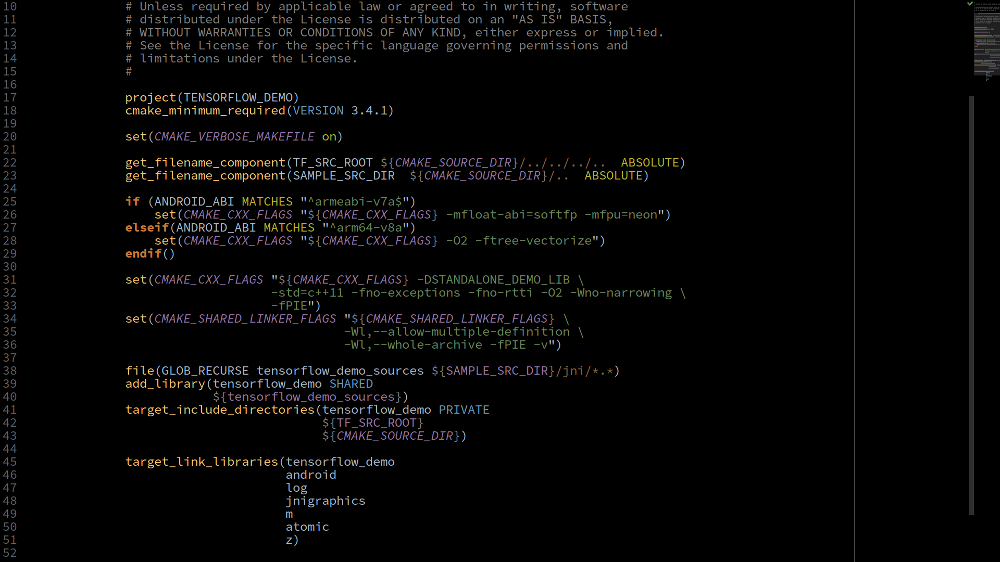
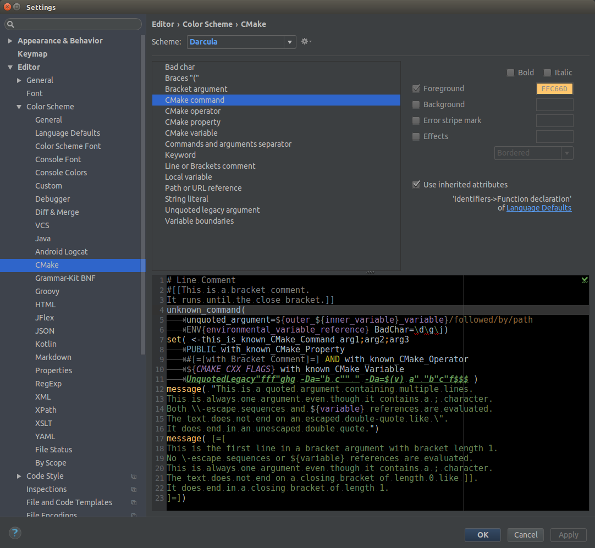

## **CMake plugin for IntelliJ Idea CE and Android Studio**

This is the plugin for CMake syntax highlight support.
It provides:  
- Basic syntax highlight for <b>IntelliJ IDEA CE</b> and <b>Android Studio</b>.
- Extend existed highlighting in <b>CLion</b>.

The main goal was to make `CMakeLists.txt` files more readable in Android Studio.
It is my play project to study intellij language support.  Please see [JetBrains manual](http://www.jetbrains.org/intellij/sdk/docs/reference_guide/custom_language_support.html) for more details. Work is still in progress.

Plugin is inspired and based on [CMaker](https://github.com/dubrousky/CMaker) by [Aliaksandr Dubrouski](https://github.com/dubrousky)

CMake Syntax from [cmake.org](https://cmake.org/cmake/help/latest/manual/cmake-language.7.html) is mostly implemented.

Till version 0.1.0 <b>IntelliJ IDEA CE</b> and <b>Android Studio</b>: Commands, Variables, Property and Operator was taken from [vim CMake support pluging](https://raw.githubusercontent.com/nickhutchinson/vim-cmake-syntax/master/syntax/cmake.vim) 
For <b>CLion</b> and from version 0.2.0 for <b>IntelliJ IDEA CE</b> and <b>Android Studio</b>: Commands, Variables, Property and Operator was taken from official [cmake.org](https://cmake.org/cmake/help/latest/index.html) manuals.

Variable declaration and usage panels (only IDEA and Android studio(till 3.2): Ctrl+B, Alt+F7, Ctrl+Click, etc.) show all visible mentions of the variable name in ALL Project's cmake files. Scope principles (function, directory, etc.) not yet implemented. Use it for guidance only not for determining variable visibility. Variable reference's specific case inside IF and WHILE conditions implemented.

Navigation between variable's declarations/references in CLion is not implemented. Might be implemented in future releases.

ENV variables navigation/renaming is not implemented yet. Nevertheless ENV variables highlighting works.

Variable's rename refactoring (Shift+F6) works fine for variables with single declaration. For multi declared (re-declared, amended) variables rename refactoring works only from variable declaration side (i.e. caret should be on variable declaration, not reference) and will change all visible references and only current declaration. use with caution, it looks for me like a bug (feature?) of IDEA.

Till version 0.1.0 <b>IntelliJ IDEA CE</b> and <b>Android Studio</b> there are few known syntax highlights bugs, mostly around `$` symbol, because it's used to recognise Variable references in arguments. But those bugs could be reproduced mostly on synthetic tests while real `CMakeLists.txt` files shown correctly.

In case you don't need such a detailed highlight (i.e. it looks too motley) you can always change colors at plugin settings.

## **Binary**
Plugin was already submitted and approved in [JetBrains Plugins Repository](https://plugins.jetbrains.com/plugin/10089-cmake-simple-highlighter) and is available in search results at Settings|Plugins|Browse repositories.

If you wish to use compiled version of pluging, please take `CMake.jar` from the root dir of that project and place file to the `<YOUR_IntelliJ_IDE>\config\plugins`  folder [(where to find it)](http://www.jetbrains.org/intellij/sdk/docs/basics/settings_caches_logs.html), and then restart your IDE so the changes may take effect. More details at [JetBrains manual](http://www.jetbrains.org/intellij/sdk/docs/basics/getting_started/deploying_plugin.html).

## **License**

Plugin is open-source software and is licenced under GPL v3 licence.

## **Versions**
**v.0.2.4**
* Finally :) tested fix of CLion 2018.2 EAP compatibility issue.  

**v.0.2.3**
* Fixed (but not tested) upcoming CLion 2018.2 EAP compatibility issue: <a href="https://youtrack.jetbrains.com/issue/CPP-12728">CPP-12728</a>.   

**v.0.2.2**
* Fixed compatibility for upcoming Android Studio 3.2 (with restricted functionality as for CLion). As a side effect the Plugin become open for all IntelliJ Platform's IDEs. 

**v.0.2.1**
* Fixed Android Studio compatibility issue.

**v.0.2.0**
* Variable declarations/references navigation (IDEA/Android studio only: Ctrl+B, Alt+F7, Ctrl+Click, etc.), renaming (IDEA/Android studio only: Shift+F6) and highlighting (IDEA/Android studio and partially CLion).

**v.0.1.0**
* CLion support added.

**v.0.0.3**
* BraceMatcher added.  

**v.0.0.2**
* Bug of not evaluating escaped escape symbol `\\` inside quoted argument fixed.

**v.0.0.1**
* Supports basic syntax highlight.

## **Build Instruction**

* To get started you need the IntelliJ Plugin development SDK, *Grammar-Kit* plugin (to build parser and lexer from bnf grammar)

* Download the code, set Plugin SDK and Java SDK

* In project properties set the `plugin.xml` location (`resources/META-INF/plugin.xml`)
* Hover the `cmake_v3.bnf` and generate parser code
* In project properties mark gen as source folder
* Generate lexer class from `CMake_org_v3.flex` file.
* Link `clion.jar` (two of them actually: from CLion 181 and below, from Clion 182 and above) to project as provided module or just create a stub at `CMakeProxyToJB.java` 
* Build project and you are set to go
